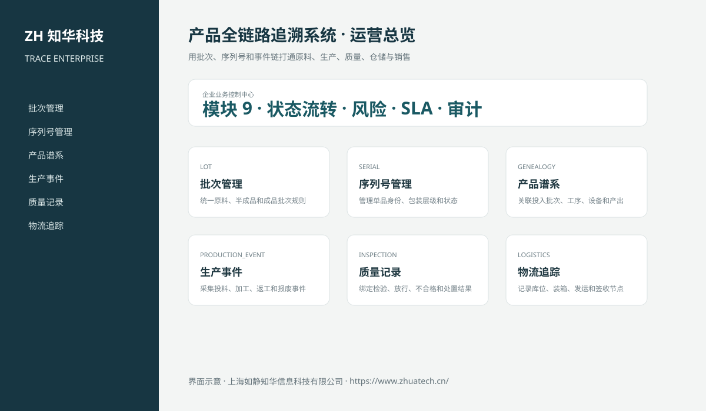
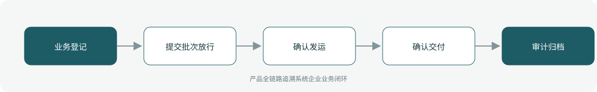

# ZhuaTech TRACE｜产品全链路追溯系统

> 用批次、序列号和事件链打通原料、生产、质量、仓储与销售

ZhuaTech TRACE 是知华科技（上海如静知华信息科技有限公司）发布的企业级源码项目，面向“批次、序列号、物料谱系、生产事件、质检、物流、销售、召回与审计”提供管理端与响应式业务端。工程采用前后端分离架构，所有示例数据均为虚构数据。

[知华科技官网](https://www.zhuatech.cn/) · [架构说明](docs/ARCHITECTURE.md) · [API 文档](docs/API.md) · [企业能力](docs/ENTERPRISE.md) · [测试说明](docs/TESTING.md)



## 业务模块

| 模块 | 核心能力 |
| --- | --- |
| 批次管理 | 统一原料、半成品和成品批次规则 |
| 序列号管理 | 管理单品身份、包装层级和状态 |
| 产品谱系 | 关联投入批次、工序、设备和产出 |
| 生产事件 | 采集投料、加工、返工和报废事件 |
| 质量记录 | 绑定检验、放行、不合格和处置结果 |
| 物流追踪 | 记录库位、装箱、发运和签收节点 |
| 销售去向 | 连接订单、客户、区域和交付批次 |
| 召回管理 | 模拟与执行正向、反向召回 |
| 追溯审计 | 检查链路完整性、时效和数据异常 |



## 企业级控制

- ADMIN / OPERATOR 角色边界和管理员接口隔离；
- 服务端字段、模块、唯一编号和状态迁移校验；
- 组织、期间、责任人、风险等级、到期日和 SLA 统计；
- 幂等创建、JPA 乐观锁、重复提交保护和职责分离；
- 附件 SHA-256 元数据、业务凭证完整性与全流程审计；
- 组合检索、分页、逾期筛选、UTF-8 CSV 导出和协作时间线；
- 外部系统仅预留适配器，使用方自行配置地址与凭据；
- prod profile 拒绝默认密码、弱数据库口令和本地跨域来源。

## 技术架构

- 后端：Java 21、Spring Boot、Spring Security、JPA、Bean Validation、Actuator
- 前端：Vue 3、Vite、Axios，支持桌面端与移动端响应式布局
- 数据库：MySQL 8；自动化测试使用 H2
- 交付：Docker Compose、Nginx、环境变量、GitHub Actions
- Java 包名：`cn.zhuatech.traceability`

## 启动与测试

```bash
cd backend && mvn test
cd ../frontend && npm install && npm run build
cd .. && cp .env.example .env && docker compose up --build
```

开发演示账号：`admin / admin123`、`operator / operator123`。生产环境必须通过环境变量替换全部默认凭据。

## 许可与商业授权

Copyright © 2026 上海如静知华信息科技有限公司。

本工程仅允许个人学习、研究和非商业技术交流，**不得用于商业用途**。企业内部使用、生产部署、SaaS运营、项目交付、品牌替换、收费培训、咨询实施或再分发，均须事先获得上海如静知华信息科技有限公司书面授权，详见 [LICENSE](LICENSE)。

深度开发、私有化部署、系统集成与企业数字化咨询，请访问[知华科技官网](https://www.zhuatech.cn/)或扫码联系：

| 微信咨询一 | 微信咨询二 |
| --- | --- |
|  |  |

SEO：产品全链路追溯系统、TRACE系统源码、企业数字化、Java企业系统、Vue管理系统、知华科技、上海如静知华信息科技有限公司。

## V2.0 专业全链路追溯域

新增批次、质量检验、放行、投入产出谱系、业务事件和召回模型。待检批次禁止进入仓储销售，来源批次只有检验放行后才能投产，投入数量不能超过可用数量；召回自动沿谱系计算所有下游影响批次。专业入口为“批次追溯中心”，API 根路径为 `/api/trace-ops`。
